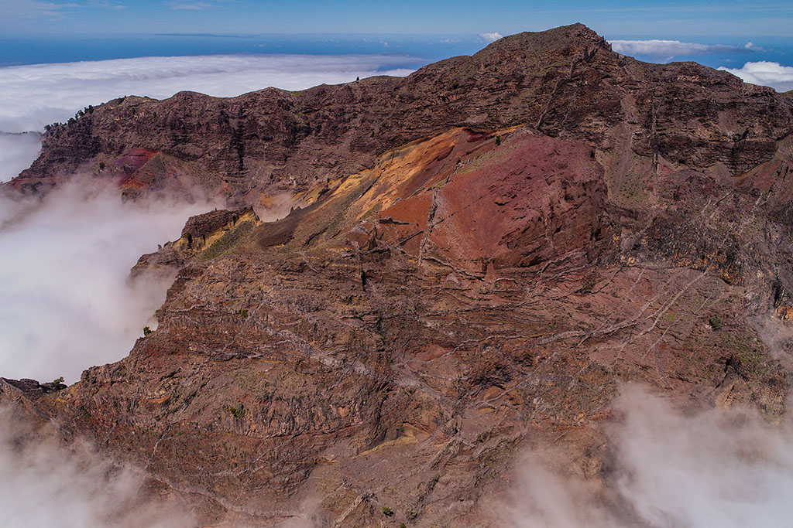

# LaPalmaVFT

A virtual field trip exploring the fantastic geology of La Palma, with a particular focus on the magmatic plumbing system exposed in Caldera Taburiente.

Click here to start the VFT: https://samthiele.github.io/lapalmavft/

Enjoy!

*The summit of Risco Liso pokes above the clouds that fill Caldera Taburiente most afternoons.*

## Contact and Contribute

If you find mistakes or would like to contribute content to this VFT, then please reach out! I would also be very interest to hear how you use it. 

The easiest way to start is to create an `Issue` (this can also be e.g., an idea) [here](https://github.com/samthiele/LaPalmaVFT/issues).

GitHub stars are also appreciated!

## Build your own tour

This VFT was build using [RockHopper](https://github.com/samthiele/rockhopper). This combines a python package for building VFTs (see [build_vft.ipynb](https://github.com/samthiele/LaPalmaVFT/blob/main/build_vft.ipynb)) with the React (javascript) front-end used to visualise everything.

`RockHopper` is still in the early stages of development, but please reach out to me if you would like to use it to create your own VFT. So long as it is open-source too, I am happy to help ヅ